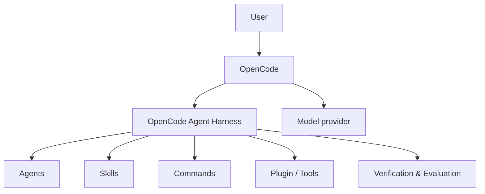

# OpenCode Agent Harness

A focused AI-engineering harness for OpenCode — specialized agents, skills, commands,
evaluation, security, RAG, observability, and context-efficient workflows for LLM and
agent development.

OpenCode remains the host and runtime. This project provides the AI-engineering
capabilities and workflows that run inside it.

## What is OpenCode Agent Harness?

OpenCode Agent Harness is a self-contained package that extends OpenCode with an
AI-engineering workflow layer. It ships:

- **7 agents** (1 primary + 6 review subagents) for AI architecture, RAG pipeline
  review, production ML review, LLM/agent evaluation, AI security, and feature
  architecture.
- **15 skills** for AI systems architecture, agent evaluation, LLM evaluation,
  AI security, prompt engineering, MCP development, LLM observability, token and
  cost optimization, and verification/regression practices for AI systems.
- **4 commands** — `/ai-review`, `/rag-review`, `/eval-run`, `/ai-security` — that
  dispatch to the matching review agent.
- **8 tools** for testing, coverage, security auditing, formatting, linting,
  dependency analysis, git summaries, and change tracking.
- **An OpenCode plugin** with hooks for auto-formatting, audit checks, session
  lifecycle handling, context compaction, environment injection, and change
  tracking.

The package is intentionally small at session start: only `AGENTS.md` and
`INSTRUCTIONS.md` are always injected; everything else loads on demand.

## Why it exists

Teams building LLM features, RAG systems, and ML pipelines typically repeat the same
review workflow: architecture and failure-mode analysis, retrieval quality checks,
model engineering review, agent output evaluation, and security review. This harness
puts those workflows behind stable OpenCode agents, commands, and skills rather than
adhoc inline review, so the review approach stays consistent across sessions and
contributors.

It is not a replacement for OpenCode, a model, a multi-agent platform, or a cloud
service. It does not add a second runtime.

## Who it is for

- Engineers building or reviewing **LLM features** and agentic AI systems.
- Teams working on **RAG engineering** and retrieval quality.
- ML/MLOps engineers shipping and monitoring **ML pipelines**.
- Developers who want **agent evaluation** and **LLM evaluation** practices.
- Anyone hardening **AI security** (prompt injection, tool abuse, MCP security).
- Teams looking to manage **context**, **token**, and **cost** in agentic sessions.

## How it works



- **OpenCode** is the host/runtime: it loads the config, agents, commands, skills,
  plugin, and tools, and connects to the model provider.
- **OpenCode Agent Harness** provides the AI-engineering capabilities and workflows —
  the review agents, skills, commands, hooks, and tools.
- The **model** executes inside OpenCode using your existing provider and API keys.

## Quick start

1. **Clone or download this repository.**
2. **Install** into your OpenCode config directory:

   Windows (PowerShell):

   ```powershell
   .\install\install.ps1
   ```

   macOS/Linux:

   ```bash
   ./install/install.sh
   ```

   The installer backs up your config, merges only what is missing, marks every change
   per config dir, and supports a clean uninstall. It never modifies anything outside
   the target config directory.

3. **Restart OpenCode** to load the plugin, agents, commands, and skills.
4. **Verify** the harness loaded:

   ```bash
   npm install
   npm run verify
   npm run build
   ```

   `npm run verify` checks that all agents, commands, and skills resolve, the config is
   valid, and the package is self-contained.

5. **Try a command:**

   ```
   /ai-review Review the architecture for the LLM feature we just added.
   ```

## What's inside

### Agents

| Agent | Type | Purpose |
|-------|------|---------|
| `build` | primary | Default coding agent for implementation work |
| `ai-architect` | subagent | AI systems architecture, model selection, failure modes |
| `rag-pipeline-reviewer` | subagent | RAG retrieval quality, chunking, reranking, grounding, eval coverage |
| `mle-reviewer` | subagent | Production ML engineering review |
| `agent-evaluator` | subagent | 5-axis LLM/agent output evaluation |
| `ai-security-reviewer` | subagent | Prompt injection, tool abuse, MCP security review |
| `code-architect` | subagent | Feature architecture blueprints from existing codebase patterns |

Full reference: [docs/AGENTS.md](docs/AGENTS.md).

### Commands

| Command | Agent | Purpose |
|---------|-------|---------|
| `/ai-review` | ai-architect | Review AI system architecture, RAG pipelines, or LLM feature design |
| `/rag-review` | rag-pipeline-reviewer | Review retrieval, chunking, reranking, and generation |
| `/eval-run` | agent-evaluator | Run an LLM/agent evaluation (5 axes, evidence-based) |
| `/ai-security` | ai-security-reviewer | Review prompt injection, tool abuse, and MCP security |

Full reference: [docs/COMMANDS.md](docs/COMMANDS.md).

### Skills

15 skills across AI architecture, evaluation, security, prompting, MCP development,
observability, cost/latency optimization, and verification workflows. All skills load
on demand — the session starts with a small, constant context footprint.

Skill index: [docs/SKILLS.md](docs/SKILLS.md).

### Tools

`run-tests`, `check-coverage`, `security-audit`, `format-code`, `lint-check`,
`git-summary`, `changed-files`, `dependency-analyzer`.

### Capability matrix

| Capability | Provided by | Purpose |
|------------|-------------|---------|
| AI architecture | `/ai-review`, ai-architecture skill | LLM/RAG/agentic design, model selection, failure modes |
| RAG engineering | `/rag-review`, rag-pipeline-reviewer | Retrieval quality, chunking, reranking, grounding |
| MLE review | mle-reviewer, mle-workflow skill | Data contracts, training reproducibility, serving, monitoring |
| Agent evaluation | `/eval-run`, agent-evaluation, eval-harness, agent-self-evaluation | 5-axis scoring, eval-driven development |
| LLM evaluation | eval-harness, agent-evaluation | Formal evaluation of agent workflows |
| AI security | `/ai-security`, ai-security skill | Prompt injection, tool abuse, MCP security, privilege escalation |
| Prompt engineering | prompt-engineering skill | Prompt design, testing, and maintenance |
| MCP development | mcp-development skill | MCP server and tool development |
| LLM observability | llm-observability skill | Logging, tracing, and monitoring |
| Token/cost/latency | cost-latency-optimization, context-budget, strategic-compact | Context budgeting and LLM cost optimization |
| Verification & regression | verification-loop, ai-regression-testing, agent-introspection-debugging | Quality gates, regression coverage, reproducible debugging |

## Examples

> `/ai-review` — review an LLM/RAG architecture.

```
/ai-review We're adding a RAG endpoint to an existing LLM feature. Assess the
architecture for retrieval quality, reranking, and failure modes before we build.
```

> `/rag-review` — review retrieval/chunking/reranking/grounding.

```
/rag-review Review our current chunking strategy and embedding choices. We want
concrete recommendations on top-k, reranking, and similarity thresholds.
```

> `/eval-run` — evaluate an AI agent.

```
/eval-run Evaluate the last agent run that added retry logic to an httpx client.
The output claimed tests pass but did not cite test output.
```

> `/ai-security` — inspect prompt injection/tool abuse/MCP risks.

```
/ai-security Review the new chat endpoint and its tool definitions for prompt
injection, tool abuse, and MCP security risks.
```

## Install and uninstall

See [install/README.md](install/README.md) for the full installer guide.

- Install: `install\install.ps1` (Windows) or `install\install.sh` (macOS/Linux).
- Uninstall: the same script with `-Uninstall` / `--uninstall`.
- The installer creates a backup, records every change in a marker file, and does not
  overwrite existing agent/command keys.

Requirements:

- OpenCode with plugin and skills support.
- Node.js 18+ for the build/verify toolchain.
- Dev dependencies (`typescript`, `@opencode-ai/plugin`, `@types/node`) for local
  builds and type checking.

## Configuration

`opencode.json` is relative-path based:

- `default_agent: build`
- 7 agents (`build` primary; 6 read-only subagents)
- 4 commands (each a `subtask` dispatching to its review agent)
- plugin: `./plugins`
- skills: `./skills` (on-demand)
- instructions: `AGENTS.md`, `INSTRUCTIONS.md` (the only always-injected files)

## FAQ

### What is OpenCode Agent Harness?

A self-contained extension for OpenCode that adds AI-engineering agents, skills,
commands, tools, and plugin hooks for building, reviewing, evaluating, and hardening
LLM-based systems.

### Who is it for?

Engineers and teams working on LLM features, RAG systems, ML pipelines, agent
evaluation, and AI security inside OpenCode.

### Does it replace OpenCode?

No. OpenCode is the host/runtime. This package adds AI-engineering workflows that run
inside OpenCode.

### Does it require ECC?

No. It is standalone. It does not use or depend on the Everything Claude Code (ECC)
repository at runtime.

### What agents are included?

Seven: `build`, `ai-architect`, `rag-pipeline-reviewer`, `mle-reviewer`,
`agent-evaluator`, `ai-security-reviewer`, and `code-architect`.

### What skills are included?

Fifteen, covering AI architecture, evaluation, security, prompt engineering, MCP
development, LLM observability, cost/latency optimization, and verification workflows.
See [docs/SKILLS.md](docs/SKILLS.md).

### What commands are included?

Four: `/ai-review`, `/rag-review`, `/eval-run`, `/ai-security`.

### How do I install it?

Run `install/install.ps1` (Windows) or `install/install.sh` (macOS/Linux) against your
OpenCode config directory, then restart OpenCode. See [Quick start](#quick-start).

### How do I remove it?

Run the same installer with uninstall mode (`-Uninstall` / `--uninstall`). It restores
your config backup, removes the keys it added, deletes the managed directory, and
removes its marker.

### Does it require API keys?

No. It uses whatever model provider is already configured in OpenCode. No additional
keys are required, and no keys are read or transmitted by this package.

### Does it include MCP servers?

No MCP servers are bundled or required. The `mcp-development` skill and
`ai-security-reviewer` help you build and secure your own MCP servers.

### Is it open source?

Yes. MIT licensed. The license and provenance details are in [LICENSE](LICENSE).

### Can I use it with my existing OpenCode setup?

Yes. The installer merges into an existing config directory, skips any agent/command
keys that already exist, and can be fully reversed.

## Development

- `npm install` — install dev dependencies.
- `npm run verify` — package self-check (config, references, self-containment).
- `npm run build` — TypeScript build to `dist/`.
- `npm pack --dry-run` — verify the publishable artifact.

See [CONTRIBUTING.md](CONTRIBUTING.md) for adding agents, commands, and skills, and
[SECURITY.md](SECURITY.md) for reporting security issues.

## Provenance

Some components were adapted from permissively licensed prior work (see the
attribution note in [LICENSE](LICENSE)). The package is not affiliated with, endorsed
by, or derived from any OpenCode or ECC product team. This project's own identity is
OpenCode Agent Harness.

## License

MIT. See [LICENSE](LICENSE).