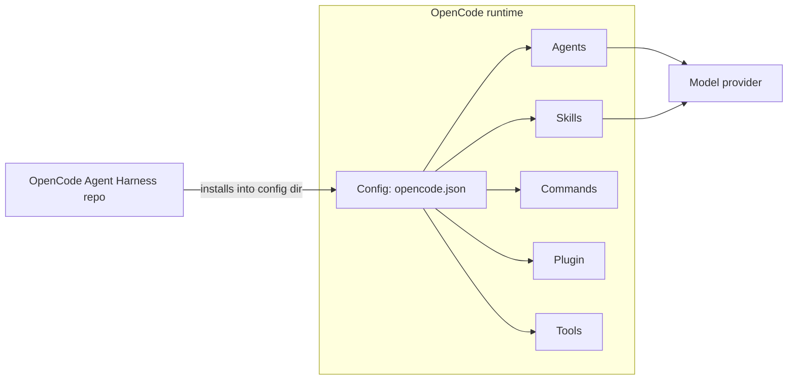

# Architecture

OpenCode Agent Harness is a configuration + plugin package that runs inside
OpenCode. It does not run its own process, service, or model.

## Component model



1. `opencode.json` is the root of everything. It is relative-path based and contains
   no personal or machine-specific paths.
2. **Instructions** (`AGENTS.md`, `INSTRUCTIONS.md`) are the only always-injected
   files — a small, constant context overhead at session start.
3. **Agents** are defined in `opencode.json` with prompts referenced via
   `{file:agents/<name>.txt}` from the `agents/` directory.
4. **Commands** map `<template> + $ARGUMENTS` to a review subagent with
   `subtask: true`, so a review runs without hijacking the main session.
5. **Skills** under `skills/` load on demand through `skills.paths`; nothing is
   injected unless invoked.
6. **Plugin** (`plugins/`) wires OpenCode hooks: shell-environment injection
   (`AIE_*` variables), session lifecycle handling, formatting/audit triggers,
   context compaction, and the `changed-files` tool that maintains a session file
   registry.
7. **Tools** under `tools/` are registered through the plugin; they express
   themselves to the model, read only, and write through normal file APIs.

## Session-start footprint

Only `AGENTS.md` and `INSTRUCTIONS.md` are injected at session start. Combined, they
are a small fraction of the model context window. Skills, agents, and tools are
referenced when relevant. The `context-budget` and `strategic-compact` skills exist
to keep long sessions lean.

## Plugin environment contract

The plugin writes `AIE_*` environment variables into the shell environment
(`AIE_VERSION`, `AIE_PLUGIN`, `AIE_HOOK_PROFILE`, `AIE_DISABLED_HOOKS`). It reads
`AIE_HOOK_PROFILE` and `AIE_DISABLED_HOOKS` when present. No other environment
contract is required; the plugin has no runtime dependency outside of OpenCode and
Node built-ins.

## Security boundary

- The plugin and tools only use Node built-ins and the OpenCode plugin API.
- Everything operates inside the user's OpenCode config directory and the current
  project. No network calls, no telemetry, no background processes.
- `opencode.json` sets `"permission": { "mcp_*": "ask" }` so MCP access requires
  approval.
- Subagents other than `build` are read-only (no write/edit tools), matching the
  review-only intent of the package.

## Runtime directory layout (after install)

OpenCode loads local plugins from `<config-dir>/plugins/` and discovers skills in
`<config-dir>/skills/<name>/SKILL.md`; agents, commands, and instructions resolve
`{file:...}` references relative to the config file. The installer honors both:

```
<config-dir>/
  opencode.json                    # merged config (backed up before merge)
  .opencode-agent-harness.marker   # exact install manifest for reversal
  plugins/                         # staged package plugin (convention dir, user files kept)
  tools/                           # staged plugin siblings (../tools/* imports), user files kept
  skills/<name>/                   # staged package skills (convention dir, user skills kept)
  opencode-agent-harness/          # managed package copy
    agents/ skills/ commands/ tools/ plugins/ install/ tests/ docs/ examples/
    AGENTS.md INSTRUCTIONS.md opencode.json package.json index.ts tsconfig.json LICENSE
```

See [install/README.md](../install/README.md) for install and uninstall behavior.